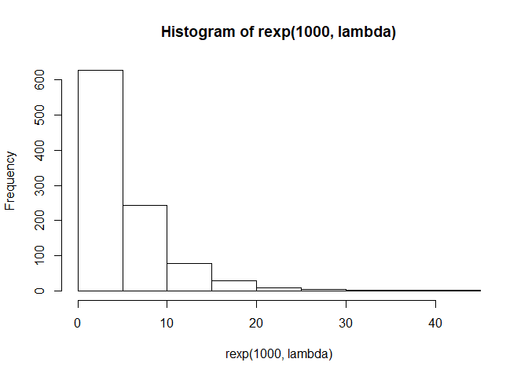
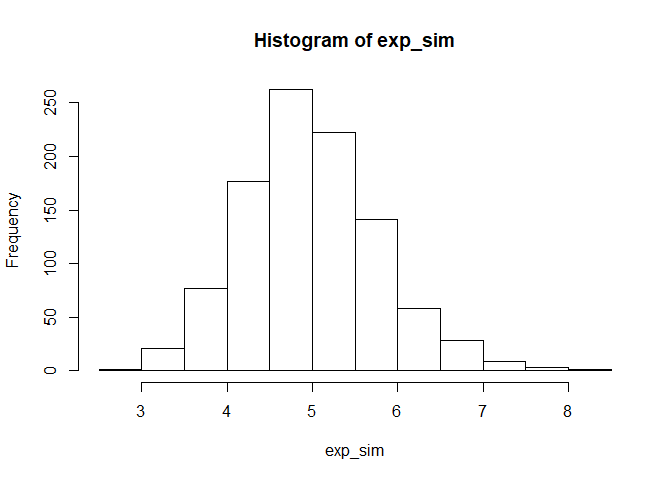

## Overview
We will be investigating the exponential distribution and comparing it to the 
Central Limit Theorem. We will do 1000 simulations of 40 exponentials, and look 
at the distribution of means, as well as the sample variance, and compare them 
to the theoretical mean and variance.

### Exponential Simulation
The code below sets the seed (to 42), then initializes all variables, and finally 
computes the mean of 40 exponentials, 1000 times, storing them in a vector. We 
will set lambda equal to 0.2.


```r
# Set seed
set.seed(42)

# 1000 simulations of 40 exponential random variables
exp_sim <- NULL
num_sims <- 1000
n <- 40
lambda <- 0.2

for (i in 1 : num_sims){
        exp_sim <- c(exp_sim, mean(rexp(n, lambda)))
}
```

### Sample Mean vs Theoretical Mean
We know that the mean of the exponential distribution is 1/lambda, in this case 
that equals 5. We also know that the sample mean is the same as the population 
mean, so if we take the mean of our computed means of 40 exponentials from 
before, we should be able to approximate the population mean of 5.


```r
# Compare sample mean to theoretical (1/lambda = 5)
mean(exp_sim)
```

```
## [1] 4.986508
```

We can see that in fact, our computed value is very close to the population mean,
which is equal to 5.

### Sample Variance vs Theoretical Variance
We also know that the standard deviation of the exponential distribution is the 
same, 1/lambda, or 5 in our case. Since the standard error of the sample mean is
sigma/sqrt(n), we can multiply the standard error by sqrt(n) to estimate the 
popultion standard deviation, which we do below.


```r
# Compare sample variance to theoretical (1/lambda = 5)
sd(exp_sim) * sqrt(n)
```

```
## [1] 5.037621
```

We can see again that this provides a good approximation of the population 
standard deviation, 5.

### Distribution
Finally we will look at the distribution of means of 40 exponentials. We first 
look at the distribution of 1000 exponentials for comparison. The Central Limit
Theorem tells us that the distribution of means approaches normal distribution 
as the sample size increases. Our second plot demonstrates this. We simply plot
a histogram of the sample means and can see that its shape appears approximately
normal.


```r
# Histogram showing distrubution of 1000 random exponential variables
hist(rexp(1000, lambda))
```

<!-- -->

```r
# Histogram showing distribtution of 1000 averages of 40 exponential variables 
hist(exp_sim)
```

<!-- -->
