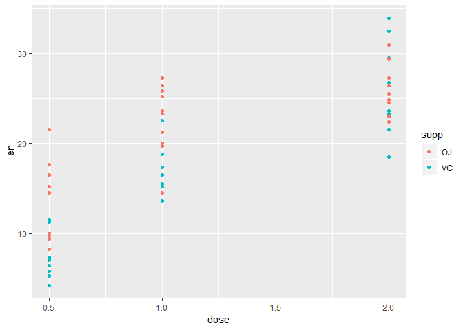
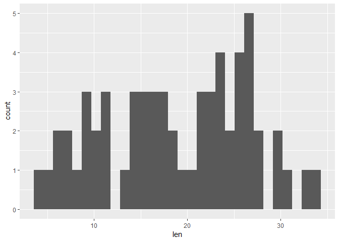

## Overview
We will be analyzing the ToothGrowth data from the R datasets package. The data 
set contains measurements of lengths of cells associated with tooth growth in 60
ginuea pigs. Each animal recieved one of three dose levels of vitamin C, via 
either orange juice or ascorbic acid. We will investigate which dose levels and 
delivery types are associated with tooth growth.

### Exploratory Analysis
We will begin by doing some preliminary exploratory analysis. We first will load
the ToothGrowth data from the R Datasets package and take a look at the first 
few rows. Then we'll peek at the structure and get a quick summary of the data.


```
##    len supp dose
## 1  4.2   VC  0.5
## 2 11.5   VC  0.5
## 3  7.3   VC  0.5
## 4  5.8   VC  0.5
## 5  6.4   VC  0.5
## 6 10.0   VC  0.5
```

```
## 'data.frame':	60 obs. of  3 variables:
##  $ len : num  4.2 11.5 7.3 5.8 6.4 10 11.2 11.2 5.2 7 ...
##  $ supp: Factor w/ 2 levels "OJ","VC": 2 2 2 2 2 2 2 2 2 2 ...
##  $ dose: num  0.5 0.5 0.5 0.5 0.5 0.5 0.5 0.5 0.5 0.5 ...
```

```
##       len        supp         dose      
##  Min.   : 4.20   OJ:30   Min.   :0.500  
##  1st Qu.:13.07   VC:30   1st Qu.:0.500  
##  Median :19.25           Median :1.000  
##  Mean   :18.81           Mean   :1.167  
##  3rd Qu.:25.27           3rd Qu.:2.000  
##  Max.   :33.90           Max.   :2.000
```

So we can see that the data are stored in a data frame, there are 60 observations
of 3 variables: len, supp, and dose. We know len refers to the length of cells 
responsible for tooth growth and that dose is the amount of vitamin C given in 
mg/day. We can also see that supp is a factor variable with two levels, "OJ" and
"VC", and refers to the delivery method (We can take a look at the help file in R
for more info).

Next we'll construct a quick plot to compare the tooth growth by dose and supp.

<!-- -->

Looking at the plot we can see that it appears higher doses may be associated with
greater tooth growth, though it is unclear if the delivery method has any bearing.
We will need to do some hypothesis testing to check, but first let's look at our
basic assumptions. Do the data appear normally distributed? We will construct a 
quick plot to check.

<!-- -->

It does not appear to be the case that the data are normal, so we will need to 
use a t-test based on the T distribution, instead of relying on the Central Limit 
Theorem. Since we are comparing two groups, we should double check to see if there
is equal variance across the groups. We do that below.


```
## # A tibble: 2 x 2
##   supp  variance
##   <fct>    <dbl>
## 1 OJ        43.6
## 2 VC        68.3
```

```
## # A tibble: 3 x 2
##    dose variance
##   <dbl>    <dbl>
## 1   0.5     20.2
## 2   1       19.5
## 3   2       14.2
```

Based on this, we cannot assume equal variance, which we will need to remember 
when doing our t-test.

### Comparing Tooth Growth by supp and dose
Now we are ready to do some hypothesis testing. We will first see if there is a
difference in dose amount (0.5 and 2.0), including both "OJ" and "VC" supp types.
Our alpha level will stay at the default of 0.05.


```
## 
## 	Welch Two Sample t-test
## 
## data:  len by dose
## t = -11.799, df = 36.883, p-value = 4.398e-14
## alternative hypothesis: true difference in means is not equal to 0
## 95 percent confidence interval:
##  -18.15617 -12.83383
## sample estimates:
## mean in group 0.5   mean in group 2 
##            10.605            26.100
```

As we can see, our p-value is less than alpha, so we can say there is a 
statistically significant difference between dose levels of 0.5 mg/day and 2.0
mg/day in resulting tooth growth.

Next we will look at supp types across all dose amounts.


```
## 
## 	Welch Two Sample t-test
## 
## data:  len by supp
## t = 1.9153, df = 55.309, p-value = 0.06063
## alternative hypothesis: true difference in means is not equal to 0
## 95 percent confidence interval:
##  -0.1710156  7.5710156
## sample estimates:
## mean in group OJ mean in group VC 
##         20.66333         16.96333
```

Since our p-value in this case is greater than alpha, we cannot say there is a 
significant difference between supp types when data for all dose levels are 
included. But let's take a look at what happens when we only include data for 
dose amounts of 0.5 mg/day.


```
## 
## 	Welch Two Sample t-test
## 
## data:  len by supp
## t = 3.1697, df = 14.969, p-value = 0.006359
## alternative hypothesis: true difference in means is not equal to 0
## 95 percent confidence interval:
##  1.719057 8.780943
## sample estimates:
## mean in group OJ mean in group VC 
##            13.23             7.98
```

Our p-value here is less than alpha, so we can say there is a significant 
difference between "OJ" and "VC" at dose levels of 0.5 mg/day.

### Conclusion & Assumptions
Based on our analysis, we may conclude that higher dose amounts are associated 
with greater tooth growth, regardless of delivery method. At the dose level of 
0.5 mg/day, "OJ" is associated with greater tooth growth than "VC" but we could 
not detect a significant difference between supp types when taking all the data 
into account across all dose levels.

For this analysis we used a t-test with the assumptions that there was not equal
variance across the different groups, and that the groups were not paired.

### Appendix
Below is the code used for this analysis.

```r
# Load necessary R packages
library(dplyr)
library(ggplot2)

# Load data and conduct simple exploratory analysis
data("ToothGrowth")

str(ToothGrowth)
head(ToothGrowth)
summary(ToothGrowth)

# Make plot comparing Tooth length over different supplements and doses 
ggplot(ToothGrowth, aes(x = dose, y = len)) + geom_point(aes(col = supp))

# Check to see if data appear normally distributed
ggplot(ToothGrowth, aes(len)) + geom_histogram()

# Check for equal variance accross supplement types
ToothGrowth %>% group_by(supp) %>%
        summarise(variance = var(len))

# Check for eaual variance accross dose amounts
ToothGrowth %>% group_by(dose) %>%
        summarise(variance = var(len))

# Conduct T test to compare dose amounts (0.5 vs 2.0)
t.test(data = filter(ToothGrowth, dose != 1.0),
       len ~ dose, paired = F, var.equal = F)

# Conduct T test to compare supplement types
t.test(data = ToothGrowth, len ~ supp, paired = F, var.equal = F)

# Conduct T test to compare supp types at dose = 0.5
t.test(data = filter(ToothGrowth, dose == 0.5),
       len ~ supp, paired = F, var.equal = F)
```
